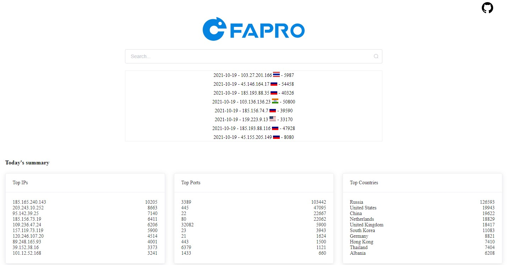
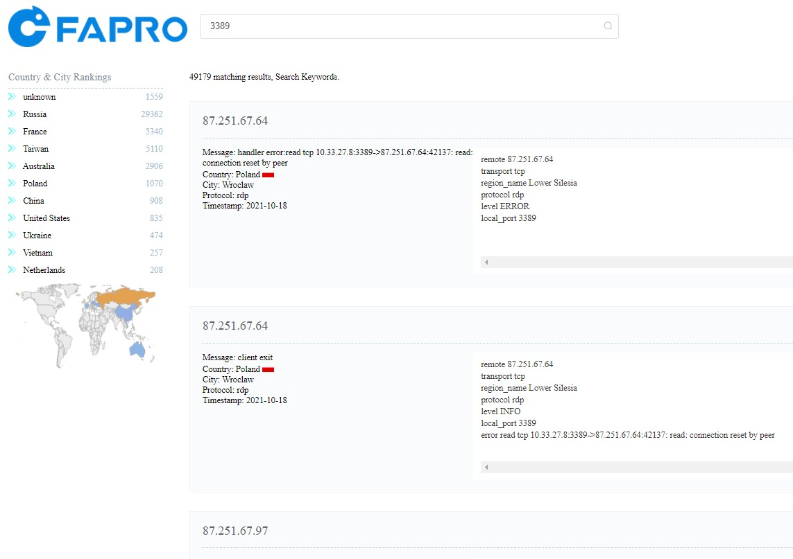
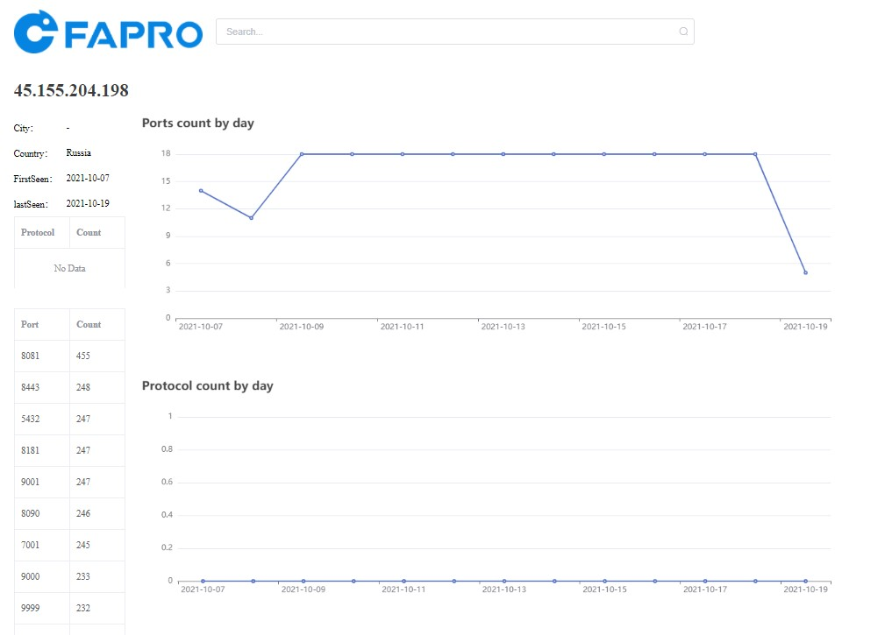
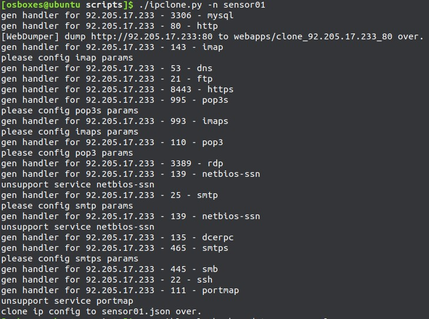
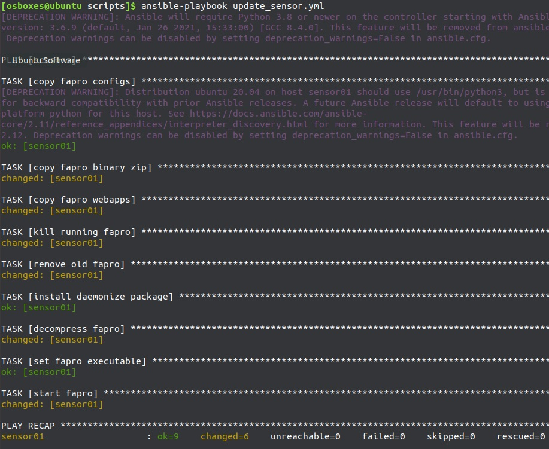
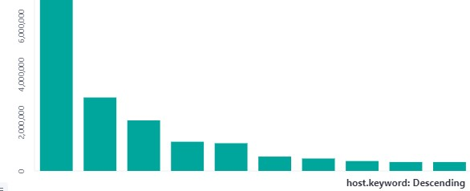

<h1 align="center">
如何打造一个网络扫描分析平台 - Part I
</h1>
<h5 align="right">如何搭建分布式的扫描日志收集系统</h5>
<br/>

### [English version](howto_1.md)

## 简介

随着网络越来越发达，网络中的各种流量也不断增多，搜索引擎，测绘引擎，恶意扫描探测，网络蠕虫等会不断扫描公网服务器以完成自身的目的。

这一系列教程介绍如何一步步搭建一个针对网络扫描的分析平台，以分析识别各种扫描流量。
找到是哪些ip在进行扫描？ 这些扫描的目的是什么？
    
现阶段的实现效果如下:





[示例网站](https://faweb.fofa.so/)

## 技术选型

收集扫描日志要做到不被扫描器发现识别为蜜罐，并且提供简单的部署方式，方便扩展和启停，最好占用较少的系统资源，这样可以节约日志收集节点的费用和维护成本。

扫描日志收集节点最好分布在各个国家，这样观测点会更全面。

最终选择使用[FaPro](https://github.com/fofapro/fapro/)，**免费、跨平台、单文件部署的网络协议服务端模拟器**，可以轻松启停多个网络服务。 更多详情，请[查看官网介绍](https://github.com/fofapro/fapro/blob/master/README-CN.md)。

通过FaPro在全球多个国家部署扫描日志收集器，可以针对每个日志收集节点开启不同的服务，模拟正常的设备，防止被扫描器识别、发现。

FaPro占用资源较少，1核1G最低配置的云服务器就可以满足需求，节约节点成本。

日志存储使用[Elasticsearch](https://www.elastic.co/guide/index.html)，方便日志检索与分析。


自动化部署与监控使用[ansible](https://docs.ansible.com/)，方便批量部署日志收集节点。

## 准备工具

linux服务器若干台(最低配置即可)，用于放置扫描数据收集器(FaPro)，最好是分布在不同区域的服务器，这样观测点会更全面，关闭现有服务器上的所有服务端口,避免收集的日志记录被干扰。

日志存储服务器，采用Elasticsearch进行日志存储与分析, 建议8G内存+200G存储，或者直接使用云服务商的Elastic服务。

本地安装ansible，用于批量部署扫描数据收集节点。示例中的本地环境使用ubuntu系统，如果使用其它系统，请参考ansible文档进行修改。

## 配置设置

### 本地ansible的配置

设置~/.ssh/config中host，添加每台服务器的配置项:

```shell
Host sensor01 #主机名
  HostName x.x.x.x #你的ip地址
  Port 22
  User root

Host dbserver
  HostName 1.2.3.4
  Port 22
  User root
```

如果使用秘钥认证，使用ssh-add 添加私钥，在终端中使用ssh dbserver应该可以登录服务器。

修改\~/.ansible.cfg配置文件:

```shell
[defaults]
gather_timeout = 60
inventory = $HOME/hosts.ini
private_key_file = $HOME/private_key.pem # private key file
```

修改\~/hosts.ini指定主机组:

```shell
[sensors] #日志收集器的服务器列表,对应.ssh/config中的主机名
sensor01
sensor02
sensor03

[dbs]
dbserver
```

克隆FaPro, 使用自动化配置脚本：

```shell
git clone https://github.com/fofapro/fapro

# 进入scripts文件夹, 使用相关的脚本及配置
cd scripts
```

### 日志服务器的配置

使用docker搭建ELK服务，日志存储服务器上安装docker以及docker-compose

复制docker-compose.yml到日志存储服务器，

修改ELASTIC_PASSWORD设置项的密码，根据需要修改公网映射的端口，

修改network.publish_host为日志存储服务器的公网ip,防止公网访问失败。

然后使用docker-compose启动ELK服务:

```shell
docker-compose up -d
```

做好防火墙配置，确保所有sensor服务器都可以访问es服务器。

### 扫描数据收集节点的配置

每个收集节点使用单独的配置文件，并且开启不同的服务，用于模拟真实设备。

设置fapro的配置文件，每个配置的文件名与主机名相同，比如sensor01.json:

```json
{
    "version": "0.40",
    "network": "127.0.0.1/32",
    "network_build": "localhost",
    "hostname": "sensor01",
    "use_logq": true,
    "storage": "es://http://elasticsearch:9200",
    "cert_name": "unknown",
    "exclusions": ["1.1.1.1"],
    "syn_dev": "any",
    "hosts": [
        {
            "ip": "0.0.0.0",
            "handlers": [
               {
                    "handler": "ftp",
                    "port": 21,
                    "params": {
                        "accounts": [
                            "ftp:123456"
                        ],
                        "welcome_message": "ProFTPD Server (ProFTPD)"
                    }
                }
            ]
        }
    ],
    "templates": null
}
```

exclusions里可以加上es服务器的ip地址，不记录es服务器ip的日志。

下载最新版本fapro到本地,保存为fapro.tgz:

```shell
wget https://github.com/fofapro/fapro/releases/latest/download/fapro_linux_x86_64.tar.gz -O fapro.tgz

tar xvzf fapro.tgz
```

针对web服务，需要进行网站克隆，首先安装chrome浏览器和chromedriver,然后执行dumpWeb,比如针对bing.com:

```shell
./fapro dumpWeb -u https://www.bing.com -a bing
[WebDumper] dump https://www.bing.com to webapps/bing over.
```

如果要模拟一个路由器，可以使用[fofa](https://fofa.so/)搜索路由器，找到一个相应的目标，再把登录页面克隆下来。

可以使用自动化配置代码中的ipclone.py脚本，直接从fofa复制ip服务配置:

使用方式,先设置FOFA\_EMAIL和FOFA\_KEY环境变量,下载好fapro, 然后运行:

```shell
# 查看使用帮助
./ipclone.py -h

./ipclone.py -i xx.xx.xx.xx -n sensor01
```



确保每个sensor服务器都有一个对应的配置文件，然后使用ansible配置所有sensor服务器:

```shell
ansible-playbook update_sensor.yml

# 或者指定只更新某些服务器,比如只配置sensor01和sensor02
ansible-playbook -l sensor01,sensor02 update_sensor.yml
```



sensor服务器的FaPro版本更新:
下载最新版的FaPro,重新执行update\_sensor.yml即可

## 结果监控

### kibana查看日志收集效果

创建一个host.keyword的柱状图，可以查看每个sensor的日志收集量:


## sensor监控

使用ansible对sensor运行状况进行监控，如果服务意外停止，则重新启动。

```shell
ansible-playbook check.yml
```

可以添加到crontab中定时执行。

或者自行搭建zabbix监控体系。

## 结语

至此，扫描日志收集平台已经搭建完毕，下一步就是对收集的日志进行分析，找到感兴趣的目标。

下一篇文章会介绍如何对收集的日志进行分析，归类。
