<h1 align="center">
如何打造一个网络扫描分析平台 - Part II
</h1>
<h5 align="right">如何分析扫描日志</h5>
<br/>

### [English version](howto_2.md)

## 简介
在[上一篇](howto_CN_1.md)我们介绍了如何搭建分布式网络扫描日志收集系统, 现在已经收集了大量的日志，如何从日志中获取想要的知识？需要进行数据分析，提出一个问题，然后从数据中去寻找答案。

我们尝试着从数据中回答一些问题：

- 每天有多少ip在进行扫描？
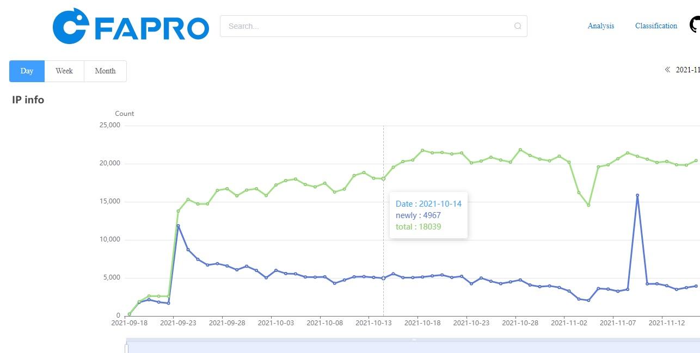
可以看到从2021-10-15日之后，平均每天有2万个ip在进行扫描

- 进行大范围扫描的ip数量趋势呢？
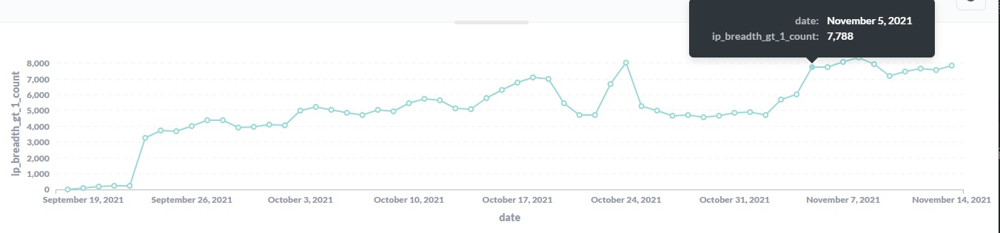
有7000个左右的ip每天在进行大范围的扫描

- 看下几个互联网扫描器进行扫描的ip数量分布情况：
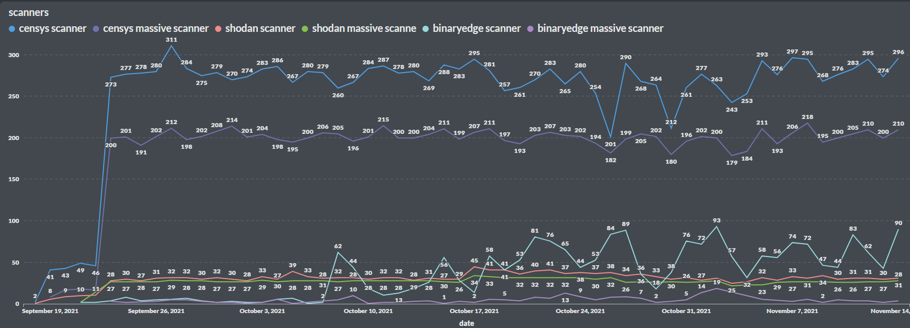
能看到censys每天有将近280个ip在进行扫描,将近180个ip在进行大范围扫描；shodan每天有35个ip在进行扫描,平均每天有25个ip在进行大范围扫描 。binaryedge比较不稳定，大概在50个ip左右,大概有10个ip在进行大范围扫描。

- 再来看看rapid7是怎么进行扫描的？
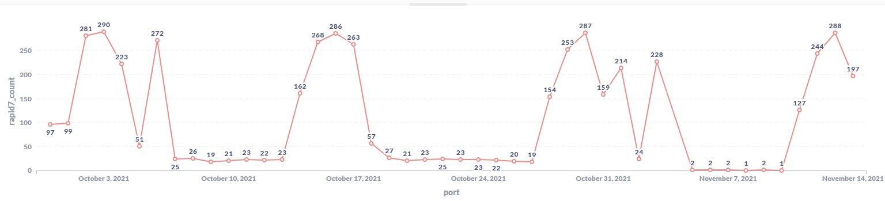
扫描策略特殊一点，能看到中间会休息一周然后突然多出大量ip进行扫描任务。

- 一天时间内的扫描广度是怎么分布的？
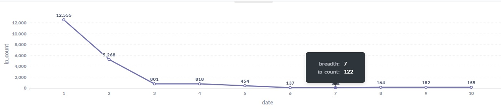
能看到绝大部分ip一天内扫描的覆盖范围(覆盖的主机数量)比较少。
扫描广度在60%、70%的比100%的还要少，也就是说中等偏上扫描范围的ip数量比较少，互联网扫描器大多会全部扫描，或者限制较少的目标范围。
或者是扫描器的能力或资源有限，要么选择轻量级更快的扫描全网，要么是速度比较慢的进行更多的端口或协议识别操作。

- 一天内ip扫描的端口数量都有多少？
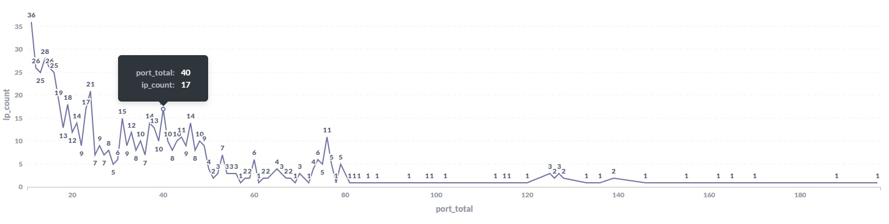
大部分ip一天内扫描的端口数量还是比较少的，扫描80个端口以上的ip数量很少

- 这些ip都在关心哪些端口？来自哪个国家？扫描范围有多广？访问了哪些服务？
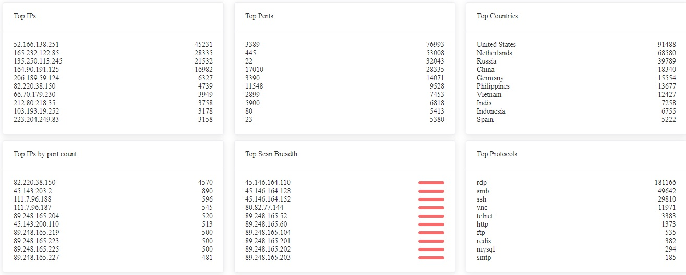
可以在[faweb](https://faweb.fofa.so/analysis/)上查看


- 再以端口为线索，大范围扫描器都在关心哪些端口？ 
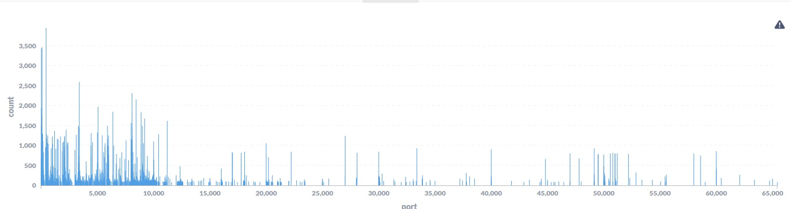
能看到大部分都集中在10000端口以下。 后面的27017、49152端口访问数量也比较大，我们来找找原因。

在[faweb中搜索port:27017](https://faweb.fofa.so/result/?word=port%3A27017),能看到有2000多条结果，
27017是mongodb的常用端口，因此各家的互联网扫描引擎也比较关注。

再看看关心27017端口的ip还会关心哪些端口:

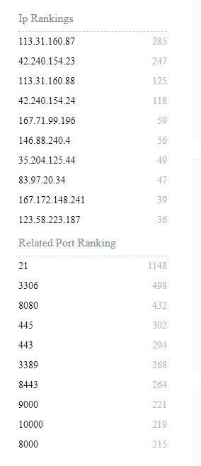

基本上是互联网扫描器会关心的常见服务端口。

来看下其中的一个ip:
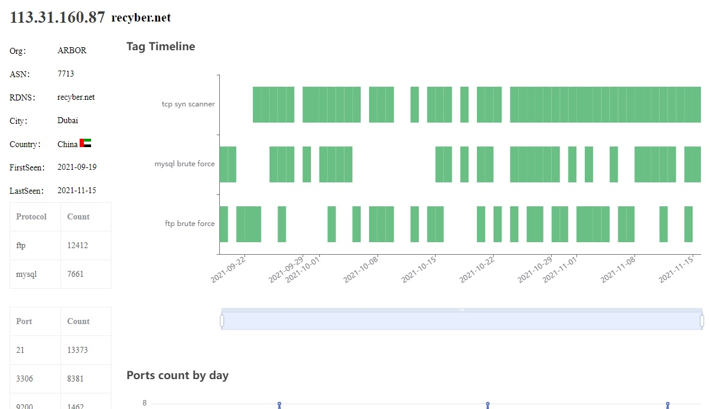

它是recyber的一个扫描器。再看其它几个ip也是扫描器的行为。

再看看[port:49152](https://faweb.fofa.so/result/?word=port%3A49152), 其中一个ip:

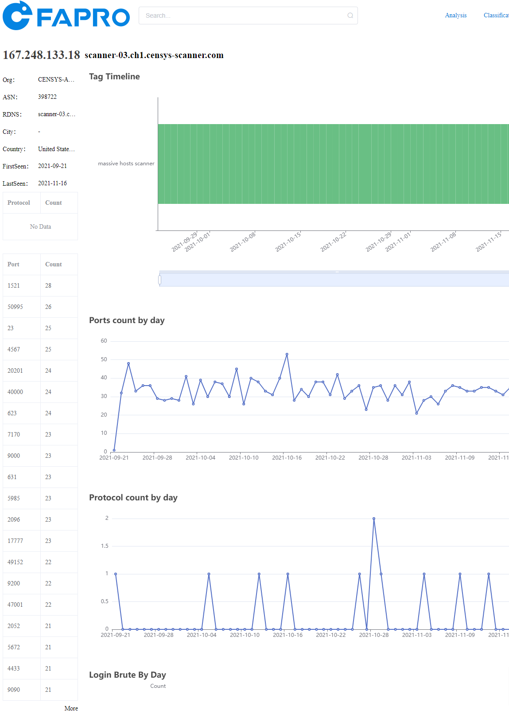

看rdns信息，应该是censys的ip地址，再看看它关心的端口列表，找几个端口,比如50995, 20201, 40000, 17777, 47001, 49152,来看看各个互联网扫描平台上有多少条独立ip的收录:

| 端口/平台      |     50995 |     20201 | 40000     |   17777 |     47001 | 49152     |
| ----         |      ---- |      ---- | ----      |    ---- |      ---- | ----      |
| shodan       |         2 |        43 | 39        |       4 |         4 | 1,488,551 |
| censys       | 1,083,024 | 2,722,622 | 1,748,078 | 311,021 | 2,827,492 | 2,054,990 |
| fofa.so      |         1 |        82 | 1,280,784 |      26 |        39 | 5,497,110 |
| zoomeye.org  |         0 |         0 | 2,018,912 |       0 |         0 | 5,762,264 |
| quake.360.cn |         7 |        18 | 47        |       2 |       483 | 3,546,927 |

下面来介绍如何对收集到的原始日志进行简单的分析，并创建规则来提供更高层次的数据以回答上面这些问题。
    
## 规则介绍
elasticsearch一个月的日志大约有100G，直接在elasticsearch中分析原始数据会对elastic造成很大压力，速度比较慢，而且做复杂的聚合查询也会超出elasticsearch的各种(bucket, request size等)限制。

FaPro收集的日志也是分散的，每个ip的访问请求会分散为很多条日志，从原始数据做聚合查询再进行分析效率非常低，因此要建立一个中间的分析库，把原始日志按时间段进行汇总，针对单个ip的行为，按照一定的规则进行聚合。

我们选择按天聚合每个ip的信息，保存到中间库，再对中间库进行分析。那么这个中间库要保存哪些数据？聚合那些信息？如何处理这些信息？

我们把它统称为规则，如何定义规则？就需要自己去分析定义，想看到哪些维度的数据？这里介绍几种简单的规则属性。

目前主要的日志种类有tcp_syn, icmp_ping, udp_packet,以及协议交互的日志, 根据从这些类型的日志中可获取的信息进行归类汇总。

根据时间段对ip的日志数据进行汇总的字段：
- port: 每天访问的所有端口
- icmp_ping: 每天访问的所有icmp ping消息的总数
- port_count: 每天访问的所有端口的总数
- tcp_port: 每天访问的所有tcp端口
- udp_port: 每天访问的所有udp端口
- **扫描广度**: 把一个ip每天扫描的目标范围进行1-10打分，比如有30个FaPro扫描日志收集器，按(ip当天访问的host数量 / 30) * 10 统一为1-10之间的数字。
- http_url: http访问的url列表
- http_user_agent: http访问的useragent列表
- mysql_login_attempts: mysql进行尝试登陆的次数
还有更多字段可以去定义，可以根据协议交互日志定义一些tag，或者频率、范围等定义出一系列的指标，方便后续的分析任务。

下面介绍如何使用elasticsearch查询实现这些规则。

## 编写规则
如果对elastic查询不熟悉，可以先借助kibana查询相应的图表，再使用inpect查看相应的查询语句，来获取elastic查询。

比如统计查询每个ip的icmp_ping次数，借助kibana的图表功能:


获取elastic查询语句后，把它转换为python代码:
```python 
top_ip_icmp_ping = es.search(index="fapro",
                             aggs={
                                 "ips": {
                                     "terms": {
                                         "field": "remote_ip",
                                         "order": {
                                             "_count": "desc"
                                         },
                                         "size": 10 # max aggs item
                                     }
                                 }
                             },
                             size=0,
                             query={
                                 "bool": {
                                     "filter": [
                                         {
                                             "bool": {
                                                 "should": [
                                                     {
                                                         "match_phrase": {
                                                             "message.keyword": "icmp_ping"
                                                         }
                                                     }
                                                 ],
                                                 "minimum_should_match": 1
                                             }
                                         }
                                     ]
                                 }
                             })

pprint.pprint(top_ip_icmp_ping['aggregations']['ips']['buckets'])
```

不过这个查询的是所有日期的数据，我们需要按天查询，并且对聚合结果进行分页查询，防止一次查询的数据过多，超过elastic的限制:
```python 
def all_ip_count(day, q, ip_aggs=None, page_size=1000):
    "get all ip count info by day"
    res = []
    total = get_total_ip(day)
    page = math.ceil(total / page_size)
    for i in range(page):
        aggs = {"ips": {"terms": {"field": "remote_ip",
                                  "include": {"partition": i,
                                              "num_partitions": page},
                                  "size": page_size}}}
        if ip_aggs:
            aggs['ips']['aggs'] = ip_aggs
        r = query(day, q, aggs = aggs, size=0)
        res += r['aggregations']['ips']['buckets']
    return res

## 获取2021-10-20的每个ip的icmp_ping消息计数
ping_info = all_ip_count("2021-10-20", 'message.keyword:"icmp_ping"')

## 获取2021-10-20的每个ip的tcp_syn消息计数
syn_info = all_ip_count("2021-10-20", 'message.keyword:"tcp_syn"')

local_port_agg = {"ports": {"terms": {"field": "local_port",
                                      "size": 1000}}}

## 获取2021-10-20的每个ip的tcp_syn消息的本地端口计数 (即这个ip通过tcp syn访问了本地端口多少次)
ip_port_info = all_ip_count("2021-10-20", 'message.keyword:"tcp_syn"', ip_aggs = local_port_agg, page_size = 100)

pprint.pprint(ip_port_info[0])
### 输出结果
{'doc_count': 1939, # tcp_syn消息次数
 'key': '94.232.47.190',
 'ports': {'buckets': [{'doc_count': 1937, 'key': 3389}, # 3389访问了1937次
                       {'doc_count': 2, 'key': 3390}], # 3390访问了2次
           'doc_count_error_upper_bound': 0,
           'sum_other_doc_count': 0}}
```

以94.232.47.190为例，访问了3389和3390端口,现在获取是否建立tcp连接信息:
```python 
tcp_info = query("2021-10-20", 'remote_ip:"94.232.47.190" AND message.keyword:"close conn"',
                 aggs=local_port_agg,
                 size=0)

pprint.pprint(tcp_info)
{'aggregations': {'ports': {'buckets': [{'doc_count': 1937, 'key': 3389},
                                        {'doc_count': 2, 'key': 3390}],
                            'doc_count_error_upper_bound': 0,
                            'sum_other_doc_count': 0}}}
```
可以看到，3389和3390的端口进行了tcp握手，建立了连接。

接下来，查询rdp访问使用的cookie信息，以获取更进一步的行为:
```python 
rdp_cookie_agg = {"cookies": {"terms": {"field": "cookie.keyword", "size": 100}}}
rdp_cookie_info = query("2021-10-20", 'remote_ip:"94.232.47.190" AND protocol:"rdp" AND cookie:"*"',
                        aggs=rdp_cookie_agg,
                        size=0)

pprint.pprint(rdp_cookie_info)
{'aggregations': {'cookies': {'buckets': [{'doc_count': 976,
                                           'key': 'Cookie: mstshash=Administr'},
                                          {'doc_count': 4,
                                           'key': 'Cookie: mstshash=Test'}],
                              'doc_count_error_upper_bound': 0,
                              'sum_other_doc_count': 0}}}
```

示例获取ip地址为45.146.164.110的http访问信息:
```python 
http_info_agg = {"uri": {"terms": {"field": "uri.keyword", "size": 100}},
                 "user-agent": {"terms": {"field": "headers.User-Agent.keyword", "size": 100}} }
http_info = query("2021-10-20", 'remote_ip:"45.146.164.110" AND protocol:"http" AND uri:"*"',
                        aggs=http_info_agg,
                        size=0)

pprint.pprint(http_info)
{'aggregations': {'uri': {'buckets': [{'doc_count': 63, 'key': '/'},
                                      {'doc_count': 54,
                                       'key': '/vendor/phpunit/phpunit/src/Util/PHP/eval-stdin.php'},
                                      {'doc_count': 30,
                                       'key': '/api/jsonws/invoke'},
                                      {'doc_count': 28,
                                       'key': '/Autodiscover/Autodiscover.xml'},
                                      {'doc_count': 28,
                                       'key': '/_ignition/execute-solution'},
                                      {'doc_count': 27,
                                       'key': '/?XDEBUG_SESSION_START=phpstorm'},
                                      {'doc_count': 27,
                                       'key': '/cgi-bin/.%2e/.%2e/.%2e/.%2e/bin/sh'},
                                      {'doc_count': 27, 'key': '/console/'},
                                      {'doc_count': 27,
                                       'key': '/index.php?s=/Index/\\think\\app/invokefunction&function=call_user_func_array&vars[0]=md5&vars[1][]=HelloThinkPHP21'},
                                      {'doc_count': 27,
                                       'key': '/wp-content/plugins/wp-file-manager/readme.txt'},
                                      {'doc_count': 22, 'key': '/index.php'},
                                      {'doc_count': 18,
                                       'key': '/solr/admin/info/system?wt=json'},
                                      {'doc_count': 17,
                                       'key': '/?a=fetch&content=<php>die(@md5(HelloThinkCMF))</php>'},
                                      {'doc_count': 10,
                                       'key': '/mifs/.;/services/LogService'}],
                          'doc_count_error_upper_bound': 0,
                          'sum_other_doc_count': 0},
                  'user-agent': {'buckets': [{'doc_count': 405,
                                              'key': 'Mozilla/5.0 (Windows NT '
                                                     '10.0; Win64; x64) '
                                                     'AppleWebKit/537.36 '
                                                     '(KHTML, like Gecko) '
                                                     'Chrome/78.0.3904.108 '
                                                     'Safari/537.36'}],
                                 'doc_count_error_upper_bound': 0,
                                 'sum_other_doc_count': 0}}}
```
然后是把一天内的所有ip依次应用这些规则进行查询，再把最终结果入库。

最开始的实现采用了elasticsearch对FaPro原始日志的分析结果进行入库，[项目地址](https://github.com/fasensor/faproana)。但是聚合查询速度很慢，对历史数据处理也不是很方便。

之后切换到[xtdb](https://xtdb.com/)，一个双时态数据库，可以更好的处理时间历史，但是Datalog查询语法学习曲线较高，性能也不是很强，为了扩容方便，采用了kafka+postgres作为后端保存事务和文档也增加了运维成本，对各种语言的api支持也比较弱。

最后切换到[clickhouse](https://clickhouse.com/), 专门为OLAP设计的数据库，可以实现高效的聚合查询，比较通用的sql语法，服务配置也比较方便，运维成本较低，查询性能很强，对于汇聚了一天的数据直接批量插入，效率非常高，各种语言的api支持也不错。


## 展示效果

将所有这些信息收集，归类到新的分析库之后，就可以对ip信息进行更高层次的分析，比如使用faweb查看[45.146.164.110](https://faweb.fofa.so/ip_detail/?ip=45.146.164.110):


可以看到45.146.164.110访问了多个协议，而没有做端口探测，因此推测它很可能是一个协议分析工具，从端口访问记录来看，随着探测到的端口增多，协议识别访问次数也增多。 从http_url来看，它尝试识别几种web应用。

再来看一个[220.174.25.172](https://faweb.fofa.so/ip_detail/?ip=220.174.25.172):


可以看到这是一个ssh爆破工具，可以看到它关心哪些端口，以及每天尝试爆破的次数。

至此，通过使用elastic查询建立规则，并入库，就可以实现一个你自己的[greynoise](https://www.greynoise.io/viz/ip/45.146.164.110)

# 结语

至此，已经完成了初步的规则创建，中间数据的入库，以及一些数据探索。更深入的行为分析，扫描意图识别等还需要更多工作要做，敬请期待第三篇。
