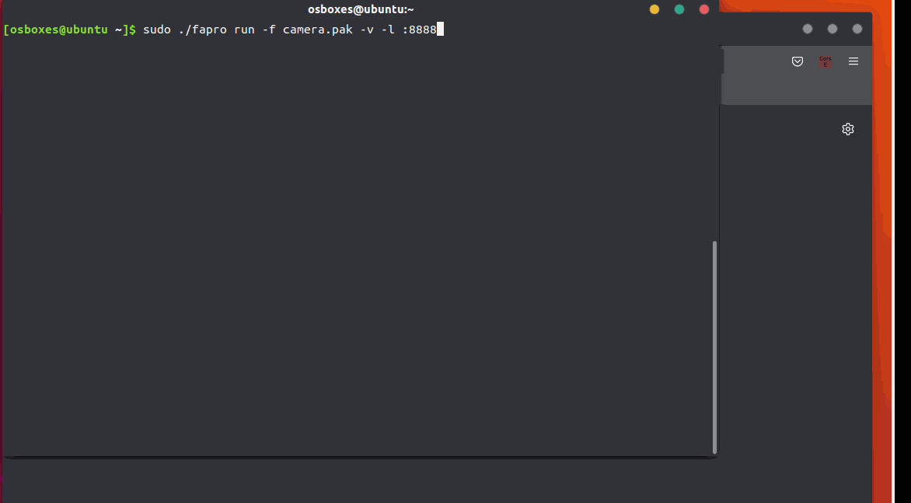

<h1 align="center">
How to use FaPro to simulate multiple devices in network
</h1>
<br/>

## Introduction

  Network and service simulation can already be done using FaPro. However, in a real environment, there are often multiple different devices in a network, and each device runs different services. To simulate a real network environment, it is necessary to simulate these devices.

  To simulate a device in a network, we need to simulate all open services on that device. We defined device rules, a rule is a set of service information on all open ports of a device.

  With FaPro, you can create a virtual network and simulate several different devices in it with a single command.

  We've created a set of device rules for surveillance video equipment from over 30 manufacturers:
```
ABUS IP Camera
ADT NVR
ADT DVR
AJA-Video-Converter
Advidia IP Camera
AirSpace DVR2
AirSpace DVR
Alibi IP Camera
CP Plus DVR2
CP Plus DVR
Canon VB-H610
Clare Control IP Camera
Dahua IP Camera2
Dahua DHI-XVR4104C-N
Dahua IP Camera
Eyesonic IP Camera
GRUNDIG IP Camera
GeoVision-Camera
HIKVISION-Camera2
HIKVISION-Camera
HUAWEI IVS
IC Realtime NVR6000K
IC Realtime NVR7000K
Illustra-camera2
Illustra-camera
InVid Tech IP Camera2
InVid Tech IP Camera
JXJ-Camera2
JXJ-Camera
KB Vision DVR
KT&C IP Camera
KT&C IP Camera2
LG-Smart-IP-Device
Lorex DVR2
Lorex DVR
Lorex DVR3
Luma IP Camera
Luma 310 IP Camera
PARTIZAN-Cameras
Q-See NVR2
Q-See NVR
TRENDnet NVR408
TRENDnet TV-IP862IC
TRENDnet NVR2208
The Surveillance Shop IP Camera
The Surveillance Shop IP Camera2
TruVision TVR Camera
TruVision NVR Camera
WebWarrior IP Camera
WebWarrior IP Camera2
WebWarrior IP Camera3
```

## Usage
Download [Camera Device Rules Pack](https://github.com/fofapro/fapro/raw/master/rules/camera.pak)

Then run fapro with root user to create the simulated device from the rules pack:
```shell
sudo ./fapro run -f camera.pak -v
```
A virtual network of 8.0.0.0/8 will be generated, and the device IP will be randomly generated.



Use the web interface to view the device rule(App) corresponding to the ip port.
